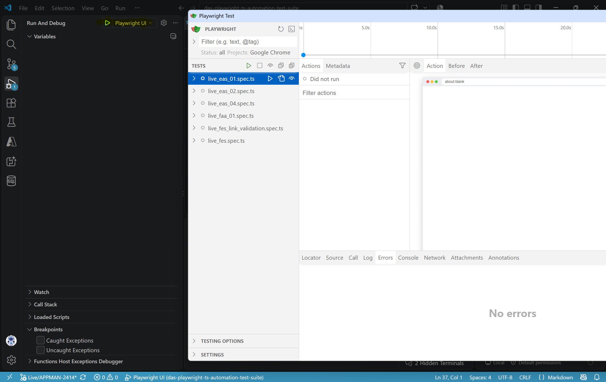

#### ⛔Never push sensitive information such as client id's, secrets or keys into repositories including in the README file⛔

# Readme for DAS Playwright Automation Test Suite using Typescript

Step 1 : Install node and import all packages

> npm install

Step 2  : Setup the env variables to run tests

> LiveEasUser={"Username":"uname","Password":"password"}
> MailasourDeviceConfig={"AccountApiToken":"test","LiveEasUserDeviceId":"test"}

Step 3 : Run tests using the following command 

> npx playwright test --grep=@tag1

Step 4 : Check teh reports in the folder results folder

> npx allure generate allure-results --clean -o allure-report; npx allure open

Alternatively luanch playwright in ui mode 

> npx playwright test --ui 

OR

